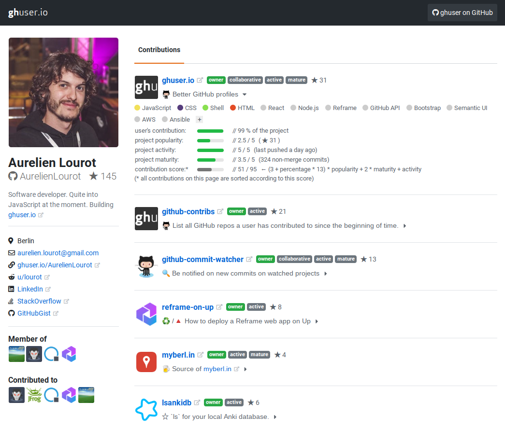

<p align="center">
  <a href="https://ghuser.io">
    
  </a>
</p>
<p align="center">
  <b>Better GitHub profiles</b>
</p>
<br />

# What we are building

> *Example: https://ghuser.io/AurelienLourot*
>
> 

We love the default GitHub profiles and we want to enhance them:

* The GitHub profiles aren't clearly showing all repos you have contributed to since you joined
  GitHub. We are showing them **all**, even those you don't own and those owned by organizations
  you're not in.<sup>[1](#footnote1)</sup>
* The GitHub profiles are listing all the repos you own but they sort them only by age of the
  latest commit. We prefer to **sort repos** by a combination of how active they are, how much you
  have contributed to them, how popular they are, etc. For each user we want to see first the latest
  greatest repos they have most contributed to.
* On GitHub only repos earn stars. We push it one step further by tranfering these **stars to
  users**. If you have built 23% of a 145 stars repo, you deserve 33 stars for that contribution. We
  add all these stars and clearly show how many of them you earned in total.
* The GitHub profiles don't clearly show how big your contribution to a repo was, when you don't own
  it. Maybe you wrote 5%. Maybe 90%. We **make it clear**.
* GitHub detects programming languages. We want to also know about
  [**technologies/frameworks**](docs/repo-settings.md), e.g. "react", "docker", etc.
* The GitHub profiles allow filtering your repos by programming language. We will allow **filtering
  by technologies/frameworks** as well.
* The GitHub profiles can be tweaked by clicking around. We allow them to be **tweaked
  programmatically**.<sup>[2](#footnote2)</sup>
* On GitHub only users and organizations have avatars. We bring
  [**avatars to repos**](docs/repo-settings.md).

Our enhanced profiles are accessible at `https://ghuser.io/<github-username>`, e.g.
[ghuser.io/AurelienLourot](https://ghuser.io/AurelienLourot).

<a name="footnote1"><sup>1</sup></a> We achieve this by using [github-contribs](https://github.com/AurelienLourot/github-contribs).<br/>
<a name="footnote2"><sup>2</sup></a> This will be implemented by [#12](https://github.com/AurelienLourot/ghuser.io/issues/12).

# Get your profile!

[ghuser.io](https://ghuser.io) is still a baby but you can already be an early user and get your
profile by [creating an issue](https://github.com/AurelienLourot/ghuser.io/issues) :)

# Roadmap

* [x] `19 Jun 2018` start coding
* [x] `04 Jul 2018` [first prototype](https://github.com/AurelienLourot/ghuser.io/milestone/1)
* [ ] `15 Aug 2018` address
      [first user feedback](https://github.com/AurelienLourot/ghuser.io/milestone/3)
* [ ] `30 Sep 2018` display more data on each profile to really make it a modern
      [programmer resume](https://github.com/AurelienLourot/ghuser.io/milestone/2)

# Contributing

[ghuser.io](https://ghuser.io) is a [Reframe](https://github.com/reframejs/reframe) web app. To run
your local changes:

```bash
$ cd reframe/
$ npm install
$ npm run local
...
 ✔ Server running (for development)
     http://localhost:3000/ -> LandingPage
     http://localhost:3000/:username -> ProfilePage
     http://localhost:3000/logo -> LogoPage
```

# Team

This project is maintained by the following person(s) and a bunch of
[awesome contributors](https://github.com/AurelienLourot/ghuser.io/graphs/contributors).

[](https://ghuser.io/AurelienLourot) | [](https://ghuser.io/brillout) |
--- | --- |
[Aurelien Lourot](https://ghuser.io/AurelienLourot) | [Romuald Brillout](https://ghuser.io/brillout) |
