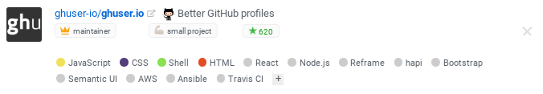

# Per-repo settings/metadata

You can set properties on any `owner/repo` by committing a file at either:
* `https://github.com/owner/repo/.ghuser.io.json`, or
* `https://github.com/owner/repo/.github/ghuser.io.json`.

## Avatar

```json
{
  "_comment": "Repo metadata for ghuser.io. See https://github.com/AurelienLourot/ghuser.io/blob/master/docs/repo-settings.md",
  "avatar_url": "https://rawgit.com/AurelienLourot/ghuser.io/master/docs/logo_square.png"
}
```

This avatar will be used on any ghuser-profile mentioning this repo:

> 

See [this example](../.ghuser.io.json).

## Techs/Frameworks

```json
{
  "_comment": "Repo metadata for ghuser.io. See https://github.com/AurelienLourot/ghuser.io/blob/master/docs/repo-settings.md",
  "techs": ["React", "Node.js", "Reframe", "Bootstrap", "Semantic UI", "AWS"]
}
```

These techs will be shown on any ghuser-profile mentioning this repo:

> 

> **WARNING**: Do not use this property for declaring programming languages. These are already
> automatically detected.

See [this example](../.ghuser.io.json).
