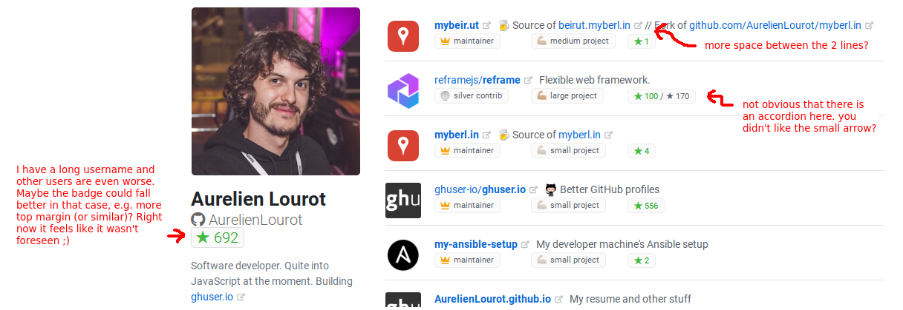

# New UI feedback

> **NOTE**: I didn't check the code.

## Table of Contents

<!-- toc -->

- [What I love](#what-i-love)
  * [Badges and icons](#badges-and-icons)
  * ["Contributed to" and external link icon](#contributed-to-and-external-link-icon)
  * [Repo descr next to repo name](#repo-descr-next-to-repo-name)
  * [One-liner contribs at the bottom](#one-liner-contribs-at-the-bottom)
- [What I like](#what-i-like)
  * ["Member of" is gone](#member-of-is-gone)
  * [What you put instead of the progress bars](#what-you-put-instead-of-the-progress-bars)
  * [You removed the tab at the top](#you-removed-the-tab-at-the-top)
  * [Big space at the bottom of the page](#big-space-at-the-bottom-of-the-page)
  * [10 stars for bronze contribs](#10-stars-for-bronze-contribs)
  * [You display the repo owners](#you-display-the-repo-owners)
- [What I like less](#what-i-like-less)
  * [You're too generous](#youre-too-generous)
- [What I think was better before](#what-i-think-was-better-before)
  * [Link to commits and PRs](#link-to-commits-and-prs)
  * [Tooltips](#tooltips)
  * [Ordering](#ordering)
- [Broken things](#broken-things)
  * ["explanation here" link](#explanation-here-link)
  * [Total amount of stars](#total-amount-of-stars)
- [Minor things](#minor-things)
  * [Browser console warning](#browser-console-warning)
  * [Mini avatars on the one-liner contribs](#mini-avatars-on-the-one-liner-contribs)
  * [Other stuff](#other-stuff)
  * [Readme to be adapted?](#readme-to-be-adapted)

<!-- tocstop -->

## What I love

### Badges and icons

They look really nice!

### "Contributed to" and external link icon

Thanks for having kept that!

### Repo descr next to repo name

Good move!

### One-liner contribs at the bottom

That's really cool! And also as you said in this area it's nice to have the bronze contribs before
the owned projects.

## What I like

### "Member of" is gone

I can see some users complaining about it but I guess it's a good move and this gives us room to
spare some API queries.

### What you put instead of the progress bars

I really liked the progress bars, but I have to admit that what you created instead looks quite
cool as well.

### You removed the tab at the top

I liked that tab because it made our UI very similar to GitHub (which is very important to me) but
that was taking space and you probably did a good move.

### Big space at the bottom of the page

Maybe too big, but it feels better than before.

### 10 stars for bronze contribs

Avoids the war on the number of commits as you said, so probably a good move.

### You display the repo owners

Probably a good move, because `ghuser-io/db` makes more sense than just `db` ;)

## What I like less

### You're too generous

I get a silver contrib for Reframe, 100 stars out of it, this feels strange honestly, because I
barely touched Reframe. I suspect silver contribs are too easy to get and/or too rewarding.

## What I think was better before

### Link to commits and PRs

On small contribs, it was possible to jump directly to my commits and PRs, so you could quickly
get to my code.

### Tooltips

When hovering badges, I was seeing hard facts, like exact number of commits, exact contrib size,
"last pushed one month ago".

### Ordering

If it's better for everyone, keep it, my own profile isn't that important. But if I look at my own
profile:

* ghuser is popular, mature, active, collaborative and I wrote 98% of it. How can it be only number
  4?
* I'm quite proud of reframe-on-up, much more than myberl.in and mybeir.ut (but I don't expect any
  algorithm to be able to notice that I'm not proud of mybeir.ut, so don't worry). Still
  reframe-on-up is a one-liner contrib at the bottom. I don't understand why.
* Writing this, I understand what bothers me most: I can't understand/reverse-engineer the sorting
  algorithm and it makes me suspect a bug.

## Broken things

### "explanation here" link

Doesn't lead to an explanation, but good move though.

### Total amount of stars

I think it's not the sum of all the contribs anymore. I didn't check precisely, but if I get now
100 stars for Reframe, my total should be around 800 stars, right?

## Minor things

### Browser console warning

```
Warning: Received `false` for a non-boolean attribute `title`.

If you want to write it to the DOM, pass a string instead: title="false" or title={value.toString()}.

If you used to conditionally omit it with title={condition && value}, pass title={condition ? value : undefined} instead.
    in div (created by Badge)
    in div (created by Badge)
    in div (created by Badge)
    in Badge (created by ContribType)
...
```

### Mini avatars on the one-liner contribs

I'd love to have mini org/repo avatars on the one-liner contribs.

### Other stuff



### Readme to be adapted?

Some sentences of the [readme](https://github.com/ghuser-io/ghuser.io#what-we-are-building) might
now be incorrect, e.g.:

> * The GitHub profiles are listing all the repos you own but they sort them only by age of the
>   latest commit. We prefer to **sort repos** by a combination of how active they are, how much you
>   have contributed to them, how popular they are, etc. For each user we want to see first the latest
>   greatest repos they have most contributed to.
> * On GitHub only repos earn stars. We push it one step further by transferring these **stars to
>   users**. If you have built 23% of a 145 stars repo, you deserve 33 stars for that contribution. We
>   add all these stars and clearly show how many of them you earned in total.
> * The GitHub profiles don't clearly show how big your contribution to a repo was, when you don't own
>   it. Maybe you wrote 5%. Maybe 90%. We **make it clear**.
